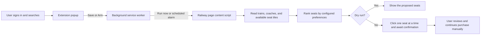

# Rail Sheba Personal Assistant

A local browser assistant that prepares one Bangladesh Railway e-ticket search, ranks available seats, and helps reserve up to four seats in a normal signed-in browser session.

The recommended implementation is an unpacked Chrome/Edge extension. It reads the journey already open on the official Railway site, lets you choose one of the trains actually returned by that search, and applies a deterministic seat preference order. A Playwright prototype is retained for development and selector inspection.

> [!IMPORTANT]
> This is a personal assistant, not an unattended purchasing bot. It does not enter credentials or passenger identity data, solve CAPTCHA or Cloudflare challenges, click **CONTINUE PURCHASE**, confirm passengers, or make payments. Bangladesh Railway remains authoritative for availability and reservations.

## Features

- Uses your existing, manually authenticated browser session.
- Reads origin, destination, journey date, class, and train names from an open Railway search-results page.
- Supports immediate runs or one scheduled release-time alarm.
- Allows one to four requested seats.
- Chooses a named coach or, when the coach is blank, the coach reporting the most available seats.
- Ranks seats by configured table groups, preferred seat numbers, adjacency, and best available fallback.
- Provides a dry-run mode that reports the plan without clicking seats.
- In live mode, clicks seats sequentially and waits for Railway to confirm each selection.
- Preserves confirmed seats on a rerun and attempts to fill only the remaining requested count.
- Detects Railway's repeated-attempt cooldown and stops instead of bypassing or probing it.
- Stops before the manual purchase workflow.

## How It Works



The extension uses only the rendered official website and standard browser-extension APIs. It does not call undocumented Railway APIs. Journey preferences are stored in `chrome.storage.local`; the scheduled time is registered with `chrome.alarms`.

Seat selection follows this order:

1. The first configured table-seat group that can satisfy the requested count.
2. The configured preferred seat numbers, if all requested seats are available.
3. A consecutive run large enough for the whole group.
4. The largest consecutive run, filled with other available seats.

If Railway does not expose enough selectable seats, the extension stops without intentionally selecting a smaller group.

## Technology Stack

| Area | Technology |
| --- | --- |
| Recommended client | Manifest V3 browser extension, JavaScript, HTML, CSS |
| Browser APIs | `chrome.alarms`, `chrome.storage`, `chrome.tabs` |
| Supported site | `https://eticket.railway.gov.bd/*` |
| Prototype runtime | Node.js 20 or newer |
| Browser automation | Playwright 1.63 |
| Tests | Node.js built-in test runner |

## Project Structure

```text
.
├── extension/                 # Recommended Chrome/Edge extension
│   ├── background.js          # Configuration, scheduling, and tab coordination
│   ├── content.js             # Railway-page interaction and live seat planning
│   ├── manifest.json          # Manifest V3 permissions and entry points
│   ├── popup.html
│   ├── popup.css
│   └── popup.js               # Popup state, validation, and commands
├── src/                       # Experimental Playwright prototype
│   ├── browser-helpers.js
│   ├── config.js
│   ├── index.js
│   ├── inspect-seat-map.js
│   ├── seat-planner.js
│   └── setup-session.js
├── test/
│   └── seat-planner.test.js   # Unit tests for prototype seat ranking
├── config.example.json        # Prototype configuration template
├── package.json
└── README.md
```

## Getting Started

### Prerequisites

For the recommended extension:

- Google Chrome or Microsoft Edge.
- A valid Bangladesh Railway account.
- Permission to install an unpacked extension in your browser.

Node.js is not required to use the extension. It is required only for the Playwright prototype and its tests.

### Clone the Repository

```powershell
git clone https://github.com/ami-JANI/rail-sheba-personal-assistant.git
Set-Location rail-sheba-personal-assistant
```

All `npm` commands in this README must be run from this repository directory, where `package.json` is located.

### Install the Extension

1. Open `edge://extensions` in Microsoft Edge or `chrome://extensions` in Google Chrome.
2. Enable **Developer mode**.
3. Select **Load unpacked**.
4. Choose this repository's `extension` directory.
5. Pin **Rail Sheba Personal Assistant** to the browser toolbar.
6. Open [Bangladesh Railway E-Ticketing](https://eticket.railway.gov.bd/) and sign in manually.

After pulling a repository update, return to the extensions page and select **Reload** for this extension.

## Usage

The most reliable workflow starts from Railway's own search results:

1. Sign in normally on the official Railway website.
2. Search for the desired origin, destination, date, and class.
3. Leave the results page open and open the extension popup.
4. Confirm the journey fields that the extension read from the current URL.
5. Select a train from the **Train** dropdown. The list contains train names detected on the current results page.
6. Configure the seat count and optional seat preferences.
7. Keep **Dry run** enabled and select **Run now**.
8. Review the proposed seats on the Railway page.
9. When satisfied, clear **Dry run** and run again or arm a future release time.
10. Review Railway's confirmed seats and total, then select **CONTINUE PURCHASE** yourself.

The extension can also start from the Railway home page. In that mode it attempts to fill the station autocomplete fields, date picker, and class before submitting one search. Because those controls are more sensitive to website changes, beginning from a manually opened results page is preferable.

### Popup Fields

| Field | Purpose |
| --- | --- |
| From / To | Journey stations; populated from an open search-results URL when available |
| Journey date | Accepts values such as `30-Sep-2026`, `30/09/2026`, or `2026-09-30` |
| Class | Railway seat class used to open the matching seat map |
| Train | Required; populated from trains detected on the open results page |
| Coach | Optional; blank selects the coach with the highest reported availability |
| Seats | Requested total from 1 to 4, including seats already confirmed on the page |
| Release time | Local date and time used by **Arm** |
| Preferred seats | Comma-separated exact seat labels, for example `KA-31, KA-32` |
| Table groups | One comma-separated group per line |
| Dry run | Plans and reports seats without clicking or reserving them |

**Save** stores the current settings. **Run now** starts one pass immediately. **Arm** schedules one alarm for a future release time. **Disarm** clears that alarm.

Keep the browser running, remain signed in, and leave the matching Railway page open for scheduled use. Browser shutdown, session expiry, site challenges, or page changes can prevent a scheduled run.

### Live Seat Selection

With dry run disabled, the extension:

1. Opens the selected train and class.
2. Selects the requested coach, or the coach with the highest displayed availability.
3. Excludes booked, disabled, hidden, pending, and already selected tiles from the new plan.
4. Counts seats already confirmed on the page toward the requested total.
5. Clicks each new seat separately and waits up to 12 seconds for Railway to confirm it.
6. Stops and reports the seats confirmed so far if Railway rejects a seat or imposes a cooldown.

A successful seat click is temporary Railway page state, not a completed ticket purchase. You must finish all remaining steps manually.

## Playwright Prototype

The `src/` implementation is an experimental alternative for development. Cloudflare may reject its automated browser even though it launches a persistent local profile and uses the Chromium security sandbox. Use the normal-browser extension when that occurs.

### Install and Configure

```powershell
npm install
Copy-Item config.example.json config.json
```

Edit `config.json`, keeping these constraints:

- `journey.passengerCount` must be an integer from 1 to 4.
- `release.at` must be a valid ISO 8601 timestamp with a timezone, such as `2026-09-20T08:00:00+06:00`.
- `execution.maxSearchAttempts` must remain `1`.
- `execution.stopBeforeReservation` must remain `true`.
- Keep `execution.dryRun` set to `true` for the first run.

Do not add passwords, OTPs, NID values, passenger identity data, or payment details to `config.json`.

Create a local signed-in browser profile:

```powershell
npm run setup-session
```

Sign in manually in the opened browser, then return to the terminal and follow the prompt. The profile is stored in the ignored `.rail-profile/` directory on that computer.

Run a dry test:

```powershell
npm run dry-run
```

After verifying the printed plan, set `execution.dryRun` to `false` and run:

```powershell
npm start
```

The prototype performs one search and one seat-selection pass, then waits for manual review. Its selectors are configurable because Railway's markup can change.

### Inspect a Seat Map

If prototype selectors no longer match the page:

```powershell
npm run inspect-seats
```

Navigate to a seat-selection page in the opened browser and press Enter in the terminal. The command writes non-sensitive element metadata to `artifacts/seat-map-elements.json`. That directory is ignored by Git. Use the output to calibrate the selectors in `config.json`.

## Testing

Install dependencies and run the unit tests:

```powershell
npm install
npm test
```

The current suite contains five unit tests for the prototype seat planner: table groups, preferred seats, exact adjacency, longest-run fallback, and refusal of an undersized group. The extension and live Railway integration do not have automated end-to-end tests; verify changes with **Dry run** against the current website.

## Privacy and Safety

- The extension is limited by its manifest to the official Railway e-ticketing origin.
- Extension settings are stored locally in the browser profile with `chrome.storage.local`.
- The Playwright session is stored locally in `.rail-profile/`, which is excluded from Git.
- `config.json`, generated artifacts, test results, and Playwright reports are excluded from Git.
- Neither implementation should receive passwords, OTPs, NID values, CAPTCHA answers, or payment details.
- The project does not attempt to evade Cloudflare, conceal automation, rotate IP addresses, or bypass Railway cooldowns.
- Use the software only in ways permitted by Bangladesh Railway's current terms and applicable law.

Review local browser data before sharing a profile or computer. Local storage is not the same as encrypted secret storage.

## Known Limitations

- Ticket availability can change between reading a seat map and clicking a seat; no reservation is guaranteed.
- Railway can change URLs, labels, classes, and page structure without notice, breaking DOM selectors.
- Seat labels and physical layouts vary by train and coach. Table groups must match the displayed labels.
- The extension is designed for one local account and one selection pass, not concurrent or bulk use.
- The extension requires a running supported browser and a valid signed-in session.
- A repeated-attempt lockout must expire at the time shown by Railway; the extension will not bypass it.
- Login, Cloudflare verification, passenger confirmation, CAPTCHA, **CONTINUE PURCHASE**, and payment remain manual.
- The Playwright prototype can be blocked by Cloudflare and may require selector calibration.
- There is no hosted service, packaged extension-store release, deployment configuration, or backend in this repository.

## Troubleshooting

### `npm` cannot find `package.json`

Run commands from the cloned repository, not from its parent directory:

```powershell
Set-Location "C:\path\to\rail-sheba-personal-assistant"
npm install
```

The extension itself does not require `npm install`.

### The Train dropdown is empty

Open a Railway train search-results page, wait for all train cards to load, then close and reopen the extension popup. The saved train is not silently reused if it is absent from the current results.

### A coach reports no acceptable seats

Leave **Coach** blank to let the extension choose the coach with the highest displayed availability, or enter a coach that Railway currently reports as available. Railway's displayed total does not guarantee that every tile remains selectable.

### Only some seats were confirmed

The server can reject later clicks after accepting an earlier one. Read the on-page status, review confirmed selections, and avoid rapid retries. A later run counts confirmed seats and plans only the remainder.

### Railway shows a repeated-attempt cooldown

Stop. Wait until Railway's displayed retry time before trying again. The extension intentionally reports the lockout rather than bypassing it.

### Cloudflare verification fails

Use the extension in a normal, manually signed-in Chrome or Edge session. Do not repeatedly retry the Playwright login or attempt to bypass the challenge.

## Contributing

Bug reports and focused improvements are welcome. When proposing a change:

1. Describe the Railway page and journey state that exposed the problem without including credentials or personal data.
2. Keep automation within the documented manual login, verification, and payment boundaries.
3. Add or update unit tests when changing reusable seat-planning behavior.
4. Run `npm test` and test the extension in dry-run mode.
5. Avoid committing `config.json`, `.rail-profile/`, or generated artifacts.

## License

This repository does not currently include a license. No permission to copy, modify, or distribute the code is granted by this README.
